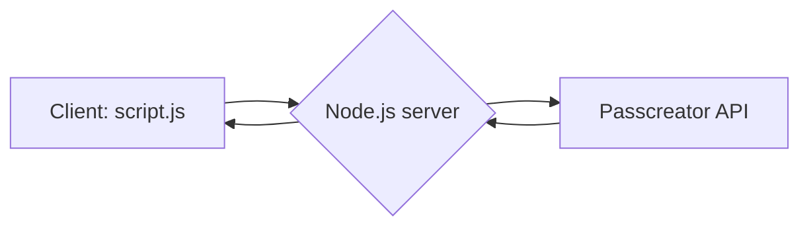

# Wallet Passes Statistics - A Proof of Concept

This project visualizes statistics for wallet passes created in passcreator.com, providing insights into active passes over time. It serves as a proof of concept, demonstrating how to connect to the PassCreator API and gather information about wallet passes.

By visualizing this data, the project offers a general overview of:

The number of active passes for each country.
Usage patterns of different types of wallet passes.
This provides valuable feedback on how final clients are interacting with the wallet passes.

At the current stage of development, the web app allows the user to switch between a `Demo mode` and a `Live mode`.

## Features

- Display active passes count
- Filter data by country (Germany or Netherlands)
- Toggle between Demo and Live modes
- Date range selection
- Time frame selection (day, month, year)

### Demo mode
In Demo mode the passes info is fetched from a [simplified-data.json](data/simplified-data.json) file in the local `node.js` server storage.

- Video demonstration of the Demo mode: [offline-mode.mp4](data/demo/demo-mode.mp4)

### Live mode
In Live mode the passes info is fetched from [passcreator API](https://developer.passcreator.com/space/API).
On the client side ([script.js](public/script.js)) requests are sent to the `node.js` local server which handles the integration with passcreator through its different endpoints.


- Video demonstration of the Live mode: [live-mode.mp4](data/demo/live-mode.mp4)


## Prerequisites

- Node.js (v18 or later)
- Docker
- Docker Compose

## Local Setup

1. Clone the repository:
   ```
   git clone <repository-url>
   cd wallet-passes-statistics
   ```

2. Create a `.env` file in the project root with the following content:
   ```
   API_KEY="my_api_key"
   PASSCREATOR_BASE_PATH="passcreator_url"
   POLICY_CARD_TEMPLATE_ID="template_id_for_the_pass_and_env"
   ```

3. Install dependencies:
   ```
   npm install
   ```

4. Start the server:
   ```
   npm start
   ```

The application will be available at `http://localhost:3001`.

## Docker Setup

1. Build the Docker image:
   ```
   docker build -t wallet-stats-poc .
   ```

2. Run the container:
   ```
   docker run -p 3001:3001 -e API_KEY=my_api_key -e PASSCREATOR_BASE_PATH=passcreator_url -e POLICY_CARD_TEMPLATE_ID=template-id
   wallet-stats-poc
   ```

## Docker Compose Setup

1. Ensure your `docker-compose.yml` file is in the project root.
2. Set your passcreator `API_KEY`, `PASSCREATOR_BASE_PATH` and `POLICY_CARD_TEMPLATE_ID` in the `docker-compose.yml`.

3. Run the application using Docker Compose:
   ```
   docker-compose up -d
   ```

The application will be available at `http://localhost:3001`.

## API Endpoints

### GET /api/passes/test
Returns test data for passes from the local server.

### GET /api/passes
Fetches pass data from the PassCreator API.

Query parameters:
- `startUid`: Starting UID for pagination
- `startCreatedOnTimestamp`: Starting timestamp for pagination

### GET /api/passes/history
Fetches historical data for active passes.

## Development

- The main server file is `server.js`.
- The application uses environment variables for configuration. Ensure these are set correctly in your `.env` file or Docker environment.
- Static files are served from the `public` directory.

The main JavaScript file is `script.js`, which contains the core functionality:

- Fetching pass data
- Filtering passes by country
- Aggregating data based on time frame
- Rendering charts
- Handling user interactions (date range, time frame, country selection)


## Scripts

- `npm start`: Start the server
- `npm run docker-build`: Build the Docker image
- `npm run docker-run`: Run the Docker container

